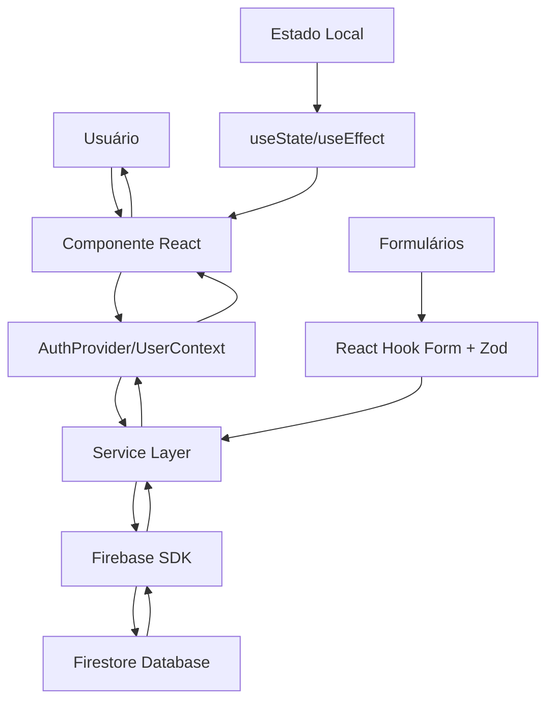

# 🏢 Jarvis Gatekeeper

**Sistema de Controle de Acesso e Gestão de Visitantes**

Um sistema moderno e intuitivo para gerenciar o acesso de visitantes em edifícios corporativos, desenvolvido com Next.js e Firebase.

---

## 📋 Índice

- [Visão Geral](#-visão-geral)
- [Funcionalidades](#-funcionalidades)
- [Stack Tecnológico](#-stack-tecnológico)
- [Arquitetura](#-arquitetura)
- [Instalação](#-instalação)
- [Configuração](#-configuração)
- [Uso](#-uso)
- [Estrutura do Projeto](#-estrutura-do-projeto)
- [Contribuição](#-contribuição)

---

## 🎯 Visão Geral

O **Jarvis Gatekeeper** é uma solução completa para controle de acesso de visitantes em ambientes corporativos. O sistema permite o registro, check-in/check-out e monitoramento de visitantes em tempo real, com interface moderna e intuitiva.

### Principais Benefícios:
- ✅ **Segurança Aprimorada**: Controle rigoroso de quem entra e sai do edifício
- ✅ **Gestão Eficiente**: Interface intuitiva para recepcionistas e administradores
- ✅ **Auditoria Completa**: Logs detalhados de todas as atividades
- ✅ **Escalabilidade**: Arquitetura moderna preparada para crescimento
- ✅ **Tempo Real**: Atualizações instantâneas do status dos visitantes

---

## 🚀 Funcionalidades

### 🔐 **Autenticação e Autorização**
- Sistema de login/registro com Firebase Authentication
- Controle de acesso com senha administrativa
- Gestão de usuários e permissões

### 👥 **Gestão de Visitantes**
- **Registro Inteligente**: Auto-preenchimento baseado em CPF
- **Check-in/Check-out**: Controle de entrada e saída
- **Validação de Capacidade**: Máximo de 3 visitantes por sala
- **Prevenção de Duplicatas**: Impede registro duplo sem checkout
- **Histórico Completo**: Visualização de todos os visitantes

### 📊 **Dashboard e Relatórios**
- **Visitantes no Prédio**: Lista em tempo real dos presentes
- **Todos os Visitantes**: Histórico completo com paginação
- **Filtros Avançados**: Busca por data e outros critérios
- **Logs de Auditoria**: Rastreamento completo de atividades

### 🏠 **Gestão de Salas**
- Salas temáticas com nomes de pedras preciosas:
  - 💎 Diamante
  - 💚 Esmeralda
  - ❤️ Rubi
  - 💙 Safira
  - 🟡 Topázio

---

## 🛠 Stack Tecnológico

### **Frontend**
- **[Next.js 15.4.5](https://nextjs.org/)** - Framework React com SSR/SSG
- **[React 19.1.0](https://reactjs.org/)** - Biblioteca para interfaces de usuário
- **[TypeScript 5](https://www.typescriptlang.org/)** - Tipagem estática
- **[Tailwind CSS 4](https://tailwindcss.com/)** - Framework CSS utilitário
- **[React Hook Form](https://react-hook-form.com/)** - Gerenciamento de formulários
- **[Zod](https://zod.dev/)** - Validação de esquemas

### **Backend & Banco de Dados**
- **[Firebase Authentication](https://firebase.google.com/products/auth)** - Autenticação de usuários
- **[Cloud Firestore](https://firebase.google.com/products/firestore)** - Banco NoSQL em tempo real
- **[Firebase SDK](https://firebase.google.com/docs/web/setup)** - Integração completa

### **Ferramentas de Desenvolvimento**
- **[ESLint](https://eslint.org/)** - Linting de código
- **[Prettier](https://prettier.io/)** - Formatação de código
- **[Git](https://git-scm.com/)** - Controle de versão

---

## 🏗 Arquitetura

### **Padrão de Arquitetura: Component-Based Architecture com Services**

O projeto segue uma arquitetura baseada em componentes React com camada de serviços para lógica de negócio:

```
┌─────────────────────────────────────────────────────────┐
│                    PRESENTATION LAYER                   │
│  ┌─────────────┐  ┌─────────────┐  ┌─────────────────┐  │
│  │    Pages    │  │ Components  │  │    Contexts     │  │
│  │ (App Router)│  │   (React)   │  │   (Providers)   │  │
│  └─────────────┘  └─────────────┘  └─────────────────┘  │
├─────────────────────────────────────────────────────────┤
│                     SERVICE LAYER                       │
│  ┌─────────────┐  ┌─────────────┐  ┌─────────────────┐  │
│  │ AuthService │  │VisitorService│  │ LoggingService  │  │
│  │             │  │             │  │                 │  │
│  └─────────────┘  └─────────────┘  └─────────────────┘  │
├─────────────────────────────────────────────────────────┤
│                      DATA LAYER                         │
│  ┌─────────────┐  ┌─────────────┐  ┌─────────────────┐  │
│  │  Firebase   │  │  Firestore  │  │      Types      │  │
│  │    Auth     │  │ Collections │  │  (TypeScript)   │  │
│  └─────────────┘  └─────────────┘  └─────────────────┘  │
└─────────────────────────────────────────────────────────┘
```

### **Estrutura Real do Projeto**

#### 🎨 **Camada de Apresentação (`/src/components` + `/src/app`)**
- **AuthForm.tsx**: Formulário de autenticação com tabs (login/registro)
- **AuthProvider.tsx**: Context Provider para gerenciamento de estado de autenticação
- **Dashboard.tsx**: Interface principal com navegação por abas
- **VisitorRegistrationForm.tsx**: Formulário de registro de visitantes com auto-fill
- **InBuildingTab.tsx**: Lista de visitantes atualmente no prédio
- **AllVisitorsTab.tsx**: Histórico completo com paginação e filtros de data
- **LogsTab.tsx**: Auditoria e logs do sistema com filtros por tipo
- **UserContext.tsx**: Context para dados do usuário logado
- **page.tsx**: Página principal (App Router)
- **layout.tsx**: Layout global da aplicação

#### ⚙️ **Camada de Serviços (`/src/services`)**
- **auth.ts**: 
  - Autenticação Firebase (login/registro/logout)
  - Validação de senha administrativa
  - Gerenciamento de perfis de usuário
- **visitors.ts**: 
  - CRUD completo de visitantes
  - Regras de negócio (máx 3 por sala, prevenção duplicatas)
  - Auto-fill baseado em CPF
  - Controle de check-in/check-out
- **logging.ts**: 
  - Sistema de auditoria completo
  - Logs de ações de usuários e visitantes
  - Categorização por tipos de ação

#### 💾 **Camada de Dados (`/src/lib` + `/src/types`)**
- **firebase.ts**: Configuração e inicialização do Firebase
- **visitor.ts**: Interfaces TypeScript para visitantes
- **user.ts**: Interfaces TypeScript para usuários
- **visitorSchema.ts**: Esquemas de validação Zod

#### 🗄️ **Coleções Firestore**
- **`users`**: Perfis de usuários do sistema
- **`visitors`**: Dados completos dos visitantes
- **`logs`**: Registros de auditoria e atividades

### **Fluxo de Dados Real**



### **Características Arquiteturais**

- **🔄 Reatividade**: Estado gerenciado com React Hooks e Context API
- **📝 Validação**: Esquemas Zod para validação de formulários
- **🔥 Tempo Real**: Firestore para atualizações em tempo real
- **🎯 Separação de Responsabilidades**: Componentes focados em UI, serviços em lógica
- **📱 Responsividade**: Tailwind CSS para design adaptativo
- **🔒 Segurança**: Autenticação Firebase com regras de acesso

---

## 📦 Instalação

### **Pré-requisitos**
- Node.js 18+ 
- npm ou yarn
- Conta no Firebase

### **Passos**

1. **Clone o repositório**
   ```bash
   git clone https://github.com/cfrinka/jarvis-gatekeeper.git
   cd jarvis-gatekeeper
   ```

2. **Instale as dependências**
   ```bash
   npm install
   # ou
   yarn install
   ```

3. **Configure as variáveis de ambiente**
   ```bash
   cp .env.example .env.local
   ```

4. **Execute o projeto**
   ```bash
   npm run dev
   # ou
   yarn dev
   ```

5. **Acesse a aplicação**
   ```
   http://localhost:3000
   ```

---

## ⚙️ Configuração

### **Variáveis de Ambiente**

Crie um arquivo `.env.local` na raiz do projeto:

```env
# Firebase Configuration
NEXT_PUBLIC_FIREBASE_API_KEY=sua_api_key
NEXT_PUBLIC_FIREBASE_AUTH_DOMAIN=seu_projeto.firebaseapp.com
NEXT_PUBLIC_FIREBASE_PROJECT_ID=seu_projeto_id
NEXT_PUBLIC_FIREBASE_STORAGE_BUCKET=seu_projeto.appspot.com
NEXT_PUBLIC_FIREBASE_MESSAGING_SENDER_ID=123456789
NEXT_PUBLIC_FIREBASE_APP_ID=1:123456789:web:abcdef

# Admin Configuration
NEXT_PUBLIC_ADMIN_PASSWORD=admin@123
```

### **Firebase Setup**

1. **Crie um projeto no [Firebase Console](https://console.firebase.google.com/)**

2. **Ative os serviços necessários:**
   - Authentication (Email/Password)
   - Cloud Firestore

3. **Configure as regras do Firestore:**
   ```javascript
   rules_version = '2';
   service cloud.firestore {
     match /databases/{database}/documents {
       match /{document=**} {
         allow read, write: if request.auth != null;
       }
     }
   }
   ```

4. **Crie os índices compostos necessários:**
   - Collection: `visitors`
   - Fields: `status` (Ascending), `createdAt` (Descending)

---

## 📖 Uso

### **1. Primeiro Acesso**
- Acesse a aplicação e clique em "Registrar"
- Insira seus dados e a senha administrativa: `admin@123`
- Faça login com suas credenciais

### **2. Registrar Visitante**
- Na aba "Registrar Visitante", preencha os dados
- O sistema auto-completa informações baseadas no CPF
- Selecione a sala de destino
- Clique em "Registrar Visitante"

### **3. Gerenciar Visitantes**
- **No Prédio**: Veja quem está presente e faça checkout
- **Todos os Visitantes**: Histórico completo com filtros
- **Logs**: Auditoria de todas as atividades

### **4. Regras de Negócio**
- Máximo 3 visitantes por sala
- Não é possível registrar visitante já presente
- Checkout obrigatório antes de novo registro
- Logs automáticos de todas as ações

---

## 📁 Estrutura do Projeto

```
jarvis-gatekeeper/
├── 📁 src/
│   ├── 📁 app/                    # App Router (Next.js 13+)
│   │   ├── 📄 layout.tsx          # Layout principal
│   │   ├── 📄 page.tsx            # Página inicial
│   │   └── 📄 visitorSchema.ts    # Esquemas de validação
│   ├── 📁 components/             # Componentes React
│   │   ├── 📄 AuthForm.tsx        # Formulário de autenticação
│   │   ├── 📄 AuthProvider.tsx    # Provider de autenticação
│   │   ├── 📄 Dashboard.tsx       # Dashboard principal
│   │   ├── 📄 VisitorRegistrationForm.tsx
│   │   ├── 📄 InBuildingTab.tsx   # Aba visitantes presentes
│   │   ├── 📄 AllVisitorsTab.tsx  # Aba todos visitantes
│   │   └── 📄 LogsTab.tsx         # Aba de logs
│   ├── 📁 services/               # Camada de serviços
│   │   ├── 📄 auth.ts             # Serviço de autenticação
│   │   ├── 📄 visitors.ts         # Serviço de visitantes
│   │   └── 📄 logging.ts          # Serviço de logs
│   ├── 📁 types/                  # Definições TypeScript
│   │   └── 📄 visitor.ts          # Tipos de visitante
│   ├── 📁 lib/                    # Utilitários
│   │   └── 📄 firebase.ts         # Configuração Firebase
│   └── 📁 hooks/                  # Custom Hooks
├── 📄 package.json                # Dependências
├── 📄 tailwind.config.js          # Configuração Tailwind
├── 📄 tsconfig.json               # Configuração TypeScript
├── 📄 .env.local                  # Variáveis de ambiente
└── 📄 README.md                   # Este arquivo
```

---

## 🤝 Contribuição

### **Como Contribuir**

1. **Fork o projeto**
2. **Crie uma branch para sua feature**
   ```bash
   git checkout -b feature/nova-funcionalidade
   ```
3. **Commit suas mudanças**
   ```bash
   git commit -m 'Adiciona nova funcionalidade'
   ```
4. **Push para a branch**
   ```bash
   git push origin feature/nova-funcionalidade
   ```
5. **Abra um Pull Request**

### **Padrões de Código**
- Use TypeScript para tipagem estática
- Siga os padrões do ESLint configurado
- Escreva commits descritivos em português
- Documente funções e componentes complexos

### **Estrutura de Commits**
```
feat: adiciona nova funcionalidade
fix: corrige bug específico
docs: atualiza documentação
style: ajustes de formatação
refactor: refatoração de código
test: adiciona ou corrige testes
```

---

## 📄 Licença

Este projeto está sob a licença MIT. Veja o arquivo [LICENSE](LICENSE) para mais detalhes.

---

## 👨‍💻 Autor

Desenvolvido com ❤️ para facilitar o controle de acesso em ambientes corporativos.

---

## 📞 Suporte

Para dúvidas, sugestões ou problemas:
- 📧 Email: suporte@jarvis-gatekeeper.com
- 🐛 Issues: [GitHub Issues](https://github.com/seu-usuario/jarvis-gatekeeper/issues)
- 📖 Wiki: [Documentação Completa](https://github.com/seu-usuario/jarvis-gatekeeper/wiki)

---

**Jarvis Gatekeeper** - *Seu porteiro digital inteligente* 🤖✨
